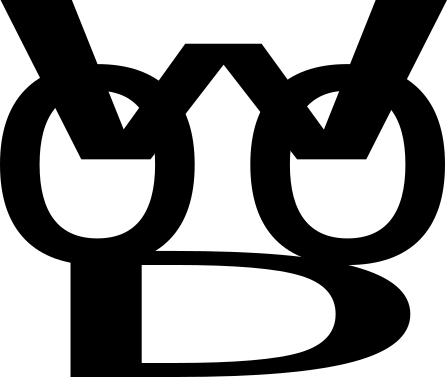

===========================================
Wood 围棋规则

“我没有创造新规则，我只是应用围棋的思想去解决了围棋的问题。“  -- wood

  1. 概述
  Wood 围棋是一套通过固定座子体系与平局胜负修正实现黑白双方严格平衡的创新围棋规则。不贴目、计算简洁、公平稳定，适用于竞技与日常对弈。

  2. 适用棋盘
  19 路棋盘（19×19）  
  13 路棋盘（13×13）  
  9 路棋盘（9×9）

  3. 开局规则
  3.1 座子位置  
  对局开始前，需在棋盘上预先放置一枚白棋座子。  
  座子位置唯一固定如下：  
  19 路：b10 坐标位置（第2行第10列）
  13 路：a7 坐标位置（第1行第7列）  
  9 路：a5 坐标位置（第1行第5列）  
  座子在对局开始前放置完毕即可，由哪一方放置不作规定。

  3.2 坐标系统  
  Wood规则采用标准围棋坐标系统：  
  坐标原点（a1）位于棋盘左下角（从白棋手视角看）：  
  - 横坐标（列）：从左到右依次为a、b、c...（跳过字母i）  
  - 纵坐标（行）：从下到上依次为1、2、3...  
  例如：b10表示第2列、第10行的交叉点。  
  注：此坐标定义与SGF棋谱格式标准一致。

  3.3 棋手座次  
  白棋手应坐在距离白棋座子最近的一侧，黑棋手坐在相对一侧。  
  简单记忆：白棋守座子，黑棋在对面。  
  你是白棋，就要守护好白棋这一侧。

  3.4 行棋顺序  
  座子放置完成后，由黑棋先行，之后双方交替落子。

  3.5 违规判定  
  若开局前未按规则放置座子，或座子位置不在允许范围内，本局需重新开局。

  4. 对局进行
  双方交替落子。  
  禁入点、提子、劫争等规则均依照通用围棋规则执行。

  5. 终局与胜负判定
  5.1 终局  
  双方连续停着（Pass），或一方认输，对局结束。

  5.2 核心定义：地（Field）  
  地 = 己方活子数 + 己方围空点  
  活子：对局结束时棋盘上存活的己方棋子  
  围空点：被己方完全围住且无子的交叉点

  5.3 胜负规则（不贴目）  
  地多者胜。  
  若双方地相等，按以下规则判定：  
  19 路：地相同 → 白胜  
  13 路：地相同 → 白胜  
  9 路：地相同 → 黑胜

  6. 其他规则
  重复局面、死活判定等未列明事项，参照通用围棋规则执行。

  7. 规则特点
  高度公平：经大量对弈验证（如10000局测试显示黑胜49.86%，白胜50.14%），黑白胜率接近50%平衡。  
  极简易懂：无贴目、无复杂换算，易于学习与普及。  
  座位明确：白棋守座子侧，赋予游戏独特的文化内涵。  
  全尺寸适配：9/13/19 路均独立平衡设计。

  8. 背景故事
  很久很久以前，这片棋盘之地并非无主之荒原。白棋的先民们在此繁衍生息，
  他们的家园就在棋盘边缘的那座白石之上——这就是今天的"座子"。

  后来，黑棋从远方而来，带着征服的野心，要与白棋争夺这片富饶的土地。
  于是，对局开始了。

  按照约定，白棋手总是坐在自己先民家园（座子）最近的那一侧，既是守护
  祖先的遗志，也是在这片土地上的最前线抵抗黑棋的进攻。

  这就是为什么在Wood围棋规则中，白棋手总是坐在座子侧——因为你不仅是在
  下棋，更是在守护自己的家园。

2026.03.07.wood

   
  <em>开源免费 • MIT协议 Wood logo 是 Wood项目的标识</em>

===========================================
Wood Go Rules

"I didn't create the new rules. I just applied the philosophy of Go to solve the problems of Go."  -- Wood

  1. Overview
  Wood Go is an innovative Go rule set that achieves strict balance between Black and White through a fixed handicap stone system and draw resolution rules. It is komi-free, simple to score, fair and stable for both competitive and casual play.

  2. Applicable Board Sizes
  19×19 board  
  13×13 board  
  9×9 board

  3. Opening Rules
  3.1 Handicap Stone Position  
  Before the game starts, one White handicap stone shall be placed on the board.  
  The handicap stone position is uniquely fixed as follows:  
  19×19: b10 coordinate position (row 2, column 10)  
  13×13: a7 coordinate position (row 1, column 7)  
  9×9: a5 coordinate position (row 1, column 5)  
  The handicap stone is placed before the game begins; who places it is not specified.

  3.2 Coordinate System  
  Wood Rules use the standard Go coordinate system:  
  The origin (a1) is at the bottom-left corner of the board (from White's perspective):  
  - Horizontal coordinates (columns): a, b, c... from left to right (skipping letter i)  
  - Vertical coordinates (rows): 1, 2, 3... from bottom to top  
  For example: b10 represents the intersection at column 2, row 10.  
  Note: This coordinate definition aligns with SGF game record format standards.

  3.3 Player Seating  
  White should sit on the side closest to the White handicap stone, with Black on the opposite side.  
  Simple memory: White guards the handicap side, Black opposite.  
  You are White, you must guard White's side.

  3.4 Play Order  
  After the handicap stone is set, Black plays first, then players alternate moves.

  3.5 Illegal Setup  
  If the handicap stone is not placed according to the rules, or is placed outside the allowed positions, the game shall be restarted.

  4. Game Play
  Players alternate moves.  
  Rules of illegal moves, capture, and ko follow standard Go rules.

  5. Endgame & Scoring
  5.1 Game End  
  The game ends when both players pass consecutively, or a player resigns.

  5.2 Core Definition: Field  
  Field = Living Stones + Owned Territory  
  Living Stones: stones remaining on the board at the end of the game  
  Owned Territory: empty intersections fully surrounded by the player

  5.3 Winning Rules (No Komi)  
  The player with the larger Field wins.  
  If Fields are equal:  
  19×19: Equal Field → White wins  
  13×13: Equal Field → White wins  
  9×9: Equal Field → Black wins

  6. Supplementary Rules
  For repeated positions, life & death, and other matters not specified, standard Go rules apply.

  7. Features
  High Fairness: Tested over many games (e.g., 10000 games showing Black 49.86%, White 50.14%), win rates approach 50% balance.  
  Extremely Simple: No komi, no complex conversions, easy to learn.  
  Clear Seating: White guards the handicap side, giving the game unique cultural depth.  
  Full-Size Adapted: Balanced separately for 9×9, 13×13, 19×19.

  8. Background Story
  Long, long ago, this board was not an ownerless wilderness. White's ancestors lived and thrived here,
  their home being the white stone at the edge of the board—what we now call the "handicap stone."

  Later, Black came from distant lands, with ambitions of conquest, seeking to wrest this rich territory from White.
  And so, the game began.

  By agreement, White always sits on the side closest to their ancestral home (the handicap stone)—both to honor
  their ancestors' legacy and to stand at the forefront of resistance against Black's invasion on this land.

  This is why in Wood Go Rules, White always sits on the handicap stone side—because you are not just
  playing a game, but guarding your homeland.

2026.03.07.wood

   
  <em>Open Source • MIT License Wood logo is the symbol of the Wood project</em>

